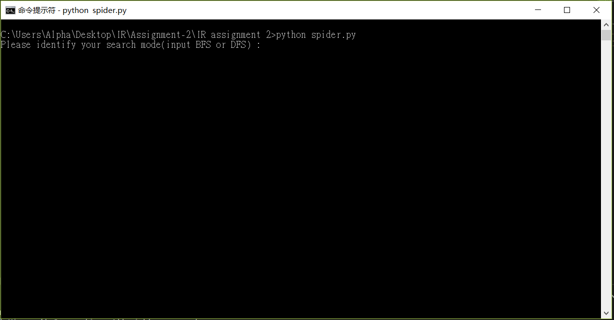
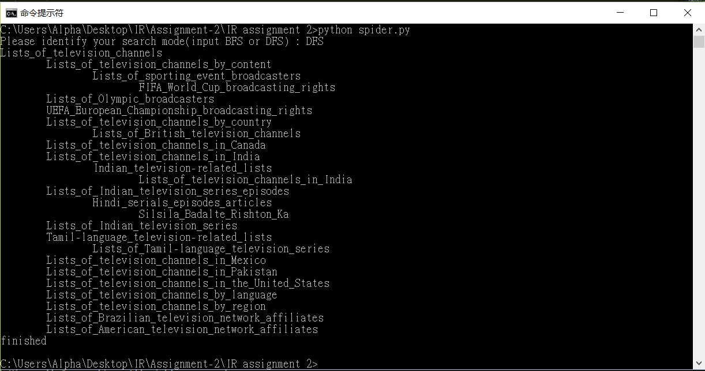
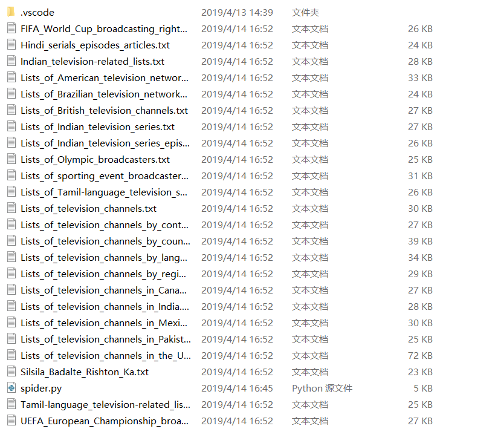

<p align="center">
  <h1 align="center">A Web Spider</h1>
  <p align="center">with Python</p>
</p> 


[](/LICENSE) 


### Keyword
> `Web Spider` `Information Retrieval` 


## Contents 
<!-- toc -->
* [Introduction](#introduction)
* [Environment](#environment)
* [Author](#author)
* [Installation](#installation)
* [User Manual](#user-manual)
* [Documentation](#documentation)
* [Development Introduction](#development-introduction)
* [Contact](#contact)
* [License](#license)

<!-- toc stop -->


## Introduction

This is a web spider for getting all the subcategory's hyperlink from a wikipeida website.

### Project Requirement


#### Basic Requirements
- Implement a simple Web Spider system, which can retrieve a given Wiki category site, such as http://en.Wikipedia.org/Wiki/Category:Technology, or http://en.Wikipedia.org/Wiki/Category:Lists_of_television_channels, using both Breadth-First Search (BFS) and Depth-First Search (DFS) search strategies. Please choose one Wiki category site to retrieve.
- Input: an URL indicating the target category website.
- Output: the names of all the subcategories on the given website, including the target category, its subcategories, the subcategories of the subcategories and so on.

#### Advanced Requirements
- Fulfill basic requirements
- Organize all the subcategories to show the relationship between the categories. For example, organize them by indentation, numbers, or a subcategory tree, etc.

#### Superior Advanced Requirements
- Fulfill advanced requirements
- Download all the web pages in the retrieved categories and save them as local files. Name the files by the category names. Use the Index/Search program you developed in Assignment 1 to do indexing/searching on the download files.
- Any other function implemented for bonus, such as developing better interface, multi-thread programming, etc.


## Environment
- Python: 3.6.5 <br>
- Windows OS <br>


## Author
- [Key](https://github.com/tavik000) <br>
- [Chen Qi](https://github.com/Cqyhid) <br>


## Installation


#### 1.1 Download the Program
```bash
git clone ...
```


## User Manual

#### 1.1 Change directory
```bash
$ cd WebSpider
```
#### 1.2 Run the program
```bash
$ python spider.py
```

#### 1.3 Select Searching Mode (DFS or BFS)
```bash
$ BFS
```

or 

```bash
$ DFS
```

 <br>

#### 1.4 Check the result

 <br>

 <br>


## Documentation


### Functions of the program

#### Spider.py

__fetch_content(self, url):
Get the content from html file.

__analysis (self, htmls):
Analysis the content of html file ,get the hyperlink from the html file.

__save_html(self, file_name, file_content):
Save and download the html from internet to local storage.

go(self, search_mode):
Include DFS and BFS. It keeping searching the content until the end.

check_content(self, key, result_dict):
Add indention for the displaying results.

result_sorting(self, result):
Add indention for displaying results.


## Development Introduction

### Basic Requirement
First, to develop the spider program. We choose “List of television channels “ for our assignment.  We use chrome browser to browse the wiki webpage. Using development mode, check the element of the website. The requirement is to get the content of subcategory, so we found all the div element from the website. We checkout all the class name from those and figure out the content of each elements. Then we found that there is a class name called “CategoryTreeItem”. So we design a regular expression to get the relevant class in our program. We use the package ‘requests’ in python to fetch the content from the website. And after we get the div element, we need to get the hyperlink from the content in the html file. We design another regular expression to get the hyperlink. 
<br><br>
For BFS and DFS, we use a list to do that. For BFS, we pop the first element from the content, then add the others after it. It’s LIFO. For DFS, It’s FIFO, we pop the last element from the content.


### Advanced Requirements	
The advanced requirements is to categorize the contents by relationship using indention or other method. We use recursion to calculate the number of indention of each subcategory’s name. We store all the data in dictionary. In the dictionary, the key of element is the name of website. The value is a list which contains all subcategory’s name.
	

	
### Superior Advanced Requirements
We save all the content in the directory locally. We need to encode the file into utf-8 and decode to cp950.  Then it can be used in the search system.
<br>


**If you like this, please leave a star.**

-----


## Contact


Email:  Peter <chenqi1123344@gmail.com>

Email:  Key <tavik002@gmail.com>


-----
## License
MIT License

Copyright (c) 2019 key

Permission is hereby granted, free of charge, to any person obtaining a copy
of this software and associated documentation files (the "Software"), to deal
in the Software without restriction, including without limitation the rights
to use, copy, modify, merge, publish, distribute, sublicense, and/or sell
copies of the Software, and to permit persons to whom the Software is
furnished to do so, subject to the following conditions:

The above copyright notice and this permission notice shall be included in all
copies or substantial portions of the Software.

THE SOFTWARE IS PROVIDED "AS IS", WITHOUT WARRANTY OF ANY KIND, EXPRESS OR
IMPLIED, INCLUDING BUT NOT LIMITED TO THE WARRANTIES OF MERCHANTABILITY,
FITNESS FOR A PARTICULAR PURPOSE AND NONINFRINGEMENT. IN NO EVENT SHALL THE
AUTHORS OR COPYRIGHT HOLDERS BE LIABLE FOR ANY CLAIM, DAMAGES OR OTHER
LIABILITY, WHETHER IN AN ACTION OF CONTRACT, TORT OR OTHERWISE, ARISING FROM,
OUT OF OR IN CONNECTION WITH THE SOFTWARE OR THE USE OR OTHER DEALINGS IN THE
SOFTWARE.


[⬆ Back to top](#contents)

**All Copyright Reserved**
